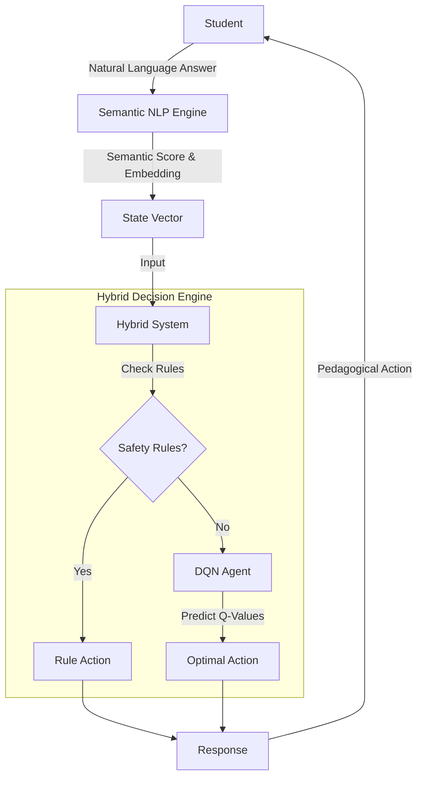

# Adaptive Personalized Tutoring System
## Using Hybrid Deep Reinforcement Learning and Semantic NLP

A next-generation AI Tutor that aims to bridge the gap highlighted by the **"2 Sigma"** effectiveness of human one-on-one tutoring. This system uses a **Hybrid Architecture** combining Pedagogical Rules with Deep Reinforcement Learning (DQN) and **Semantic NLP** to personalize education dynamically.


---

## 🌟 Key Features

### 1. 🧠 Hybrid Decision Engine
*   **Deep Q-Network (DQN):** Optimizes the long-term learning trajectory using a novel **"Delta-Reward"** function that prioritizes knowledge gain over short-term test scores.
*   **Safety Layer:** A rule-based guardrail that prevents pedagogical failures (e.g., ensuring prerequisites are met before advancing).
*   **Action Masking:** Enforces the curriculum dependency graph while allowing the AI flexibility in *how* to teach.

### 2. 🗣️ Semantic NLP Assessment
*   **Beyond Multiple Choice:** Uses **Sentence-BERT (`all-MiniLM-L6-v2`)** to evaluate open-ended student responses.
*   **Continuous Grading:** Provides granular scores (e.g., 7.5/10) based on semantic similarity to expert answers, rather than binary correct/incorrect.
*   **Adversarial Robustness:** Includes mechanisms to detect "gaming the system" (e.g., keyword stuffing).

### 3. 📚 Non-Linear Playlist
*   **Dynamic Curriculum:** Unlike static playlists, the AI acts as a "Director," dynamically inserting revision, practice, or harder content based on real-time fatigue and mastery estimation.
*   **Smart Pause:** (Roadmap) Intelligently pauses video content to ask checking questions.

### 4. 📊 Explainable AI Dashboard
*   **Real-Time Visualization:** Watch the "Brain" of the tutor as it updates the student's estimated Knowledge State ($K$) and Engagement ($E$).
*   **Decision Transparency:** See exactly *why* the AI chose a specific action (e.g., "Reason: High mastery but low engagement -> Increase Difficulty").

---

## 🚀 Quick Start

### 1. Installation
```bash
make install
```

### 2. Run the Dashboard (Developer View)
Watch the agent teach a simulated student in the `Streamlit` dashboard.
```bash
make dashboard
```

### 3. Run the "Real World" App (Student View)
**Step A: Start the API Brain**
```bash
make api
```
*(Keep this terminal running)*

**Step B: Open the Student Portal**
Open a new terminal and run:
```bash
make client
```
This opens `ai_tutor_rl/client/index.html` in your browser. You can now take quizzes and get recommendations!

---

## 🧪 Reproducibility & Experiments

To reproduce the results presented in our IEEE paper:

### 1. Training & Evaluation
```bash
# Train the DRQN Agent
python -c "import sys; sys.path.append('ai_tutor_rl'); from train import train_drqn; train_drqn(episodes=400)"

# Compute Statistical Significance (p-values, Cohen's d)
make stats
```

### 2. Generate Paper Plots
Generate all figures (Learning Curves, Ablation Study, Sensitivity Analysis):
```bash
make plots
```
The figures will be saved in the root directory as `paper_plot_*.png`.

### 3. Cross-Dataset Robustness
Evaluate the agent's performance across simulated OULAD, ASSISTments, and EdNet environments:
```bash
python ai_tutor_rl/evaluate_cross_dataset.py
```

### 4. Human Study Protocols
The full protocol for our Randomized Controlled Trial (RCT) is available in:
- `human_study/experiment_protocol.md`
- `human_study/consent_form_template.md`

Run the analysis script on study data:
```bash
python human_study/analyze_study_data.py
```

---

## 🏗️ Architecture



### Decision Logic
1.  **Rule Layer (Priority)**: Handles edge cases.
    *   *Score < 5.0 & Difficulty ≤ 0.15* → **Revision** (Prevent frustration).
    *   *Score > 9.0 & Difficulty ≥ 0.8* → **Next Topic** (Prevent boredom).
2.  **RL Layer (Optimization)**: Handles the "Average Case".
    *   Optimizes the exact difficulty adjustment to maximize long-term learning (Knowledge Gain).

---

## 🛠️ Project Structure

- **`ai_tutor_rl/api.py`**: The production backend. Contains the Hybrid Logic & NLP integration.
- **`ai_tutor_rl/app.py`**: Streamlit dashboard for visualization.
- **`ai_tutor_rl/src/nlp_engine.py`**: The Semantic NLP module (Sentence-BERT).
- **`ai_tutor_rl/src/agent.py`**: The DQN Agent with Action Masking.
- **`ai_tutor_rl/src/env.py`**: The `StudentEnv` gymnasium environment.
- **`ai_tutor_rl/client/`**: HTML/JS frontend for the Student Portal.

---

## 📊 Training & Evaluation

To retrain the RL agent from scratch:
```bash
make train
```
The model is saved to `models/dqn_tutor.pth`.

Compare the AI against a static baseline:
```bash
make evaluate
```

---

## 🔮 Roadmap
- [ ] **Khan Academy Integration:** YouTube IFrame API control for "Smart Pause".
- [ ] **Duolingo Gamification:** Adding "Streak Freezes" and "Leagues" to the engagement model.
- [ ] **Generative Content:** Integrating Sora/HeyGen for custom video explanations.
