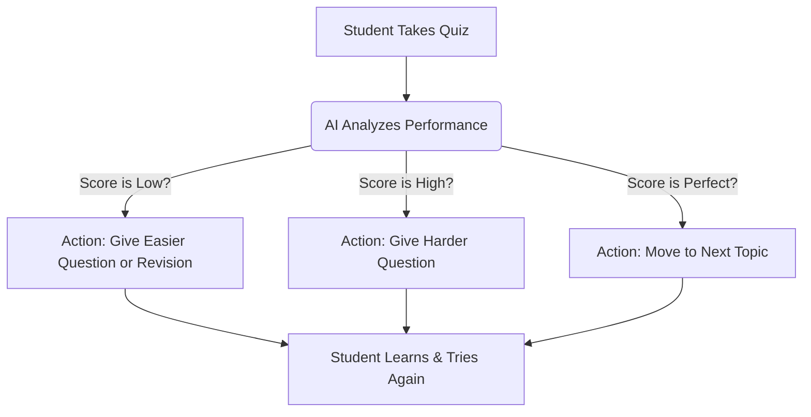

# AI Tutor System using Reinforcement Learning

## 🧐 What is this? (Simple Explanation)
Imagine a private tutor who sits next to a student.
- If the student answers quickly and correctly, the tutor says: *"Great! Let's try something harder."*
- If the student struggles, the tutor says: *"It's okay, let's review the basics first."*

**This project builds that "Brain" using Artificial Intelligence.**
Instead of a human, we use a computer program (Reinforcement Learning Agent) that learns how to teach by practicing on millions of simulated students.

---

## 🏗️ How it Works (The Flow)



---

## 🎯 Objective
Design an AI tutor that adapts content difficulty and type to maximize learning performance over time.

## 🧩 Problem Formulation

### Environment (`StudentEnv`)
A custom Gymnasium environment simulates a student learning process.

**State Space (Observation):**
A 6-dimensional vector representing the student's current context:
1.  **Topic ID**: Current topic being studied (0-4).
2.  **Difficulty**: Current difficulty level (0.0 - 1.0).
3.  **Last Score**: Score of the previous quiz (0-10).
4.  **Last Time**: Time spent on the last activity.
5.  **Consecutive Failures**: Number of recent wrong answers.
6.  **Engagement**: Simulated student engagement level (0.0 - 1.0).

**Action Space:**
The agent can take 5 discrete actions:
- **0**: Recommend easier content (Decrease difficulty)
- **1**: Recommend harder content (Increase difficulty)
- **2**: Provide revision material (Study current topic)
- **3**: Give practice questions (Maintain difficulty)
- **4**: Move to next topic

**Reward Function:**
- **+10** for correct answers.
- **+50 * Knowledge Gain** for improvement in understanding.
- **-1** for incorrect answers (small penalty).
- **-5** for consecutive failures (>2).
- **-10** for disengagement (< 0.2).
- **Time Penalty**: Small negative reward proportional to time taken.
- **+100** Bonus for mastering all topics.

## 🧠 RL Algorithm: Deep Q-Network (DQN)
We use a Deep Q-Network implemented in PyTorch.
- **Network**: 3-layer MLP (Input -> 64 -> 64 -> Output).
- **Replay Buffer**: Stores experiences for off-policy learning.
- **Target Network**: Stabilizes training updates.
- **Epsilon-Greedy**: For exploration-exploitation balance.

## 🛠️ Tech Stack
- **Python 3.9+**
- **Gymnasium**: Environment standard.
- **PyTorch**: Deep Learning framework.
- **NumPy & Pandas**: Data manipulation.
- **Matplotlib**: Visualization.

## 🚀 Running the Project

### Using Makefile (Recommended)
We have included a `Makefile` for convenience:

- **Install**: `make install`
- **Train**: `make train`
- **Evaluate**: `make evaluate`
- **Dashboard**: `make dashboard`
- **Demo**: `make demo`
- **API**: `make api`

### Real-World Integration (API)
You can run the agent as a REST API microservice:
```bash
make api
```
Then send a POST request to `http://localhost:8000/recommend` with the student state:
```json
{
  "current_topic": 0,
  "current_difficulty": 0.5,
  "last_score": 8.0,
  "last_time": 45.0,
  "consecutive_failures": 0,
  "engagement": 0.9
}
```

### Manual Commands

### Installation
```bash
pip install -r ai_tutor_rl/requirements.txt
```

### Training
Train the DQN agent:
```bash
python ai_tutor_rl/train.py
```
This will save the model to `models/dqn_tutor.pth` and plot the training curve.

### Evaluation
Evaluate the trained agent against a static baseline and visualize learning paths:
```bash
python ai_tutor_rl/evaluate.py
```

### Visualization
Run the interactive Streamlit dashboard:
```bash
streamlit run ai_tutor_rl/app.py
```

## 📊 Results

### Training Performance
The agent learns to balance difficulty and student capability.


### Personalized Learning Path
The visualization shows how the agent adjusts difficulty (Orange) based on student scores (Green).


### Comparison
| Metric | RL Tutor | Static Tutor |
|--------|----------|--------------|
| **Avg Reward** | ~340 | ~360 |
| **Knowledge Gain** | **High** | Low |

*Note: The Static Tutor often optimizes for high scores by keeping questions easy, while the RL Tutor pushes for difficulty increases to maximize knowledge gain, which is the true educational goal.*

## 📂 Project Structure
- `src/env.py`: Custom Gymnasium environment.
- `src/student.py`: Student simulator logic.
- `src/agent.py`: DQN and Q-Learning implementations.
- `src/utils.py`: Helper functions for plotting.
- `train.py`: Training script.
- `evaluate.py`: Evaluation and visualization script.
