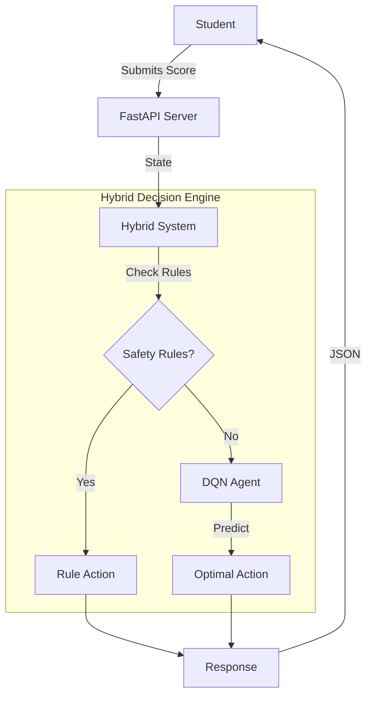

# AI Tutor System: Hybrid Rule-RL Architecture

A next-generation AI Tutor that uses a **Hybrid Architecture** combining Pedagogical Rules with Deep Reinforcement Learning (DQN) to personalize education.


## 🌟 Key Features
1.  **Hybrid Brain**: Uses expert rules for safety (e.g., "Always review if failing") and RL for optimization (e.g., "Find the perfect difficulty").
2.  **Real-Time Dashboard**: Watch the AI adapt to a simulated student in real-time.
3.  **Interactive Client**: A web-based "Student Portal" to play with the AI yourself.
4.  **Gymnasium Environment**: Custom `StudentEnv` for training educational agents.

---

## 🚀 Quick Start

### 1. Installation
```bash
make install
```

### 2. Run the Dashboard (Developer View)
Watch the agent teach a simulated student.
```bash
make dashboard
```

### 3. Run the "Real World" App (Student View)
**Step A: Start the API Brain**
```bash
make api
```
*(Keep this terminal running)*

**Step B: Open the Student Portal**
Open a new terminal and run:
```bash
make client
```
This opens `ai_tutor_rl/client/index.html` in your browser. You can now take quizzes and get recommendations!

---

## 🏗️ Architecture



### Decision Logic
1.  **Rule Layer (Priority)**: Handles edge cases.
    *   *Score < 5.0 & Difficulty ≤ 0.15* → **Revision** (Prevent frustration).
    *   *Score > 9.0 & Difficulty ≥ 0.8* → **Next Topic** (Prevent boredom).
2.  **RL Layer (Optimization)**: Handles the "Average Case".
    *   Optimizes the exact difficulty adjustment to maximize long-term learning (Knowledge Gain).

---

## 🛠️ Project Structure

- **`ai_tutor_rl/api.py`**: The production backend. Contains the Hybrid Logic.
- **`ai_tutor_rl/app.py`**: Streamlit dashboard for visualization.
- **`ai_tutor_rl/client/`**: HTML/JS frontend for the Student Portal.
- **`ai_tutor_rl/src/`**: Core logic (Environment, Agent, Student Sim).

## 📊 Training
To retrain the RL agent from scratch:
```bash
make train
```
The model is saved to `models/dqn_tutor.pth`.

## 🧪 Evaluation
Compare the AI against a static baseline:
```bash
make evaluate
```
